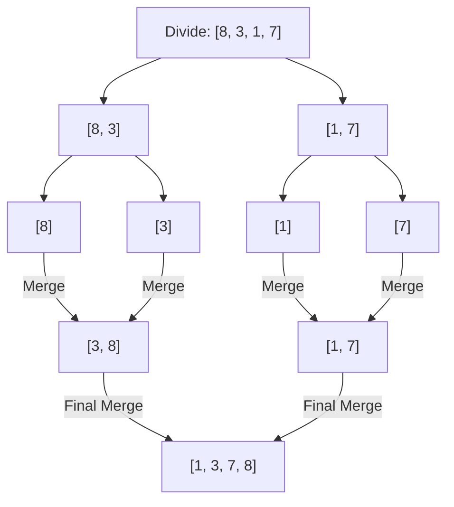
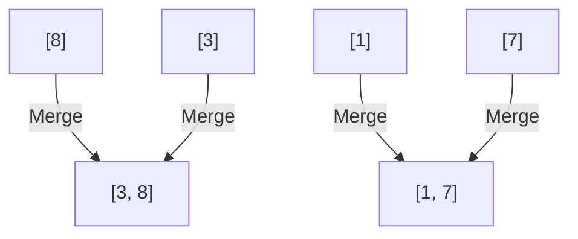
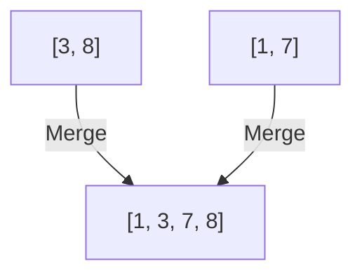

# Divide Conquer Combine（分治）

开篇第一类算法，便是分治，如果我没有理解错的话，对于分治算法来说，最重要的便是如何将我们面临的庞大问题分解成结构相同，只是在规模和参数上更小一点的子问题（divide），而理论上来说规模更小的子问题的求解难度势必要比原问题小，那么求解完子问题后（conquer），将各个子问题的解合并（combine），按照我们朴素的猜测，理应是会得到待求解的大问题的解，不是吗？

分治是一种思想，而不是解决某一具体问题的详细算法，它的智慧是融入在具体问题之中的，接下来以归并排序（merge sort）为例解释分治的思想。

## merge sort

排序是十分常见的算法，古往今来（？）提出了许多不同思路的算法，比如最朴素的选择排序，有点意思的冒泡排序，利用额外数据结构的堆排序，或者说脑洞大开的快速排序，我们对于规律的渴望永无止尽。

### divide

若一个算法能对某个混乱的数组按照某种规律排序，理论上来讲是与数组的大小无关的（算法希望解决的是问题，而非特例），也就是说无论数组的长度为多少，merge sort都应该能做到，而且试想，对于一个已经完成了排序的数组，其任意一部分是不是都应当时完成了排序的呢，换一个角度来说，要想将一个数组完成排序，必定需要将其每一个子区间之内都排好序，且这些子区间之间也是有序的。

分治思想的特征已经呼之欲出了，尽管现在我们没有走太远，也让我们来梳理一下目前已有的信息：

1. 对于任意长度的数组，merge sort算法都能将其按某种规律排序
2. 若要排序数组，那么其子数组也应当被排序

综上所述，若想解决数组排序问题，我们可以先通过将其子数组排好序解决一部分问题，而merge sort理应也可以将子数组进行排序，也就是说原先的问题分解如下图所示：

那么，对每一个子数组再进行一次merge sort，但是我们似乎没有说规模更小的子数组应该怎么排序啊，这么看来，即便排序的规模变小了，我们面临的困难似乎没有减少。

先别急，我们先锲而不舍地接着divide下去，发现了吗，不管我们是如何分割（divide）的，到最后我们都会将不管多大的数组切分成许多许多的单个元素，对吗？

那么我们看，长度为一的数组的排序问题是不是自然而然就能解决了————压根就不需要解决！

### combine

其实上述的分割（divide）看上去确实有些耍无赖，如果只是将大数组分割成小块又原封不动地合并回去，那不还是原来的的数组吗！

所以说分治算法的核心其实不在于分（divide），因为分（divide）往往是一个观察寻找子问题并将其以一定界限分开考虑的过程，真正的魔法（magic）发生在combine中。

我们考虑这么一个数组方便我们理解：

[1，3，2，4]

我们切分一下，就沿着中间切吧

[1，3]，[2，4]

你看子数组内确实是排列整齐的，但是合并之后却不是排列整齐的，究其原因，就是每一个子数组所位于的范围上下限产生了交集，而并（combine）就是要解决这么一个问题。

对于长度为一的数组，从直觉上来看是很容易合并的

我们只需要单纯地比较然后排列就行了，那再长一点的呢

我们可以每一次都比较子数组的第一个元素，并将更小（大）的元素存进下一级的结果中，这时，被拿走的元素的下一个元素，便成为下一个待比较的元素，而这样的正确性是通过子数组有序保证的。

不难发现，如果自己动手实现的话，长度为一的数组可以不单独考虑，直接融入上述的整体逻辑即可。

## efficiency？（效率）

merge sort算法本身不难理解，但是我们需要证明的是，这样的算法的效率如何，解决问题的方法千奇百怪，但是只有效率高的算法，才称得上好算法。

设原直接解决排序问题所需要耗费的时间为 $T(n)$，当然我们且不论这个$T(n)$是用什么排序方法得出的，那如果我们通过分治的思想，将其分成若干子数组（假设分为$a$个子数组） ，则对每个子数组，其长度变为$n/a$，他们所耗费的总时间应该变为$aT(n/a)$，当然也不要忘记分解所需要耗费的时间，记为$D(n)$，以及合并这些子问题耗费的时间，记为$C(n)$

同时，通过上面的例子，我们也不难发现，随着问题规模的逐渐减小，当越过某一界限时，子问题的求解将会变得非常容易（甚至不需要求解），这种简单求解所需要的时间，由于其已经被划分得极小，其所需时间可以记为$\theta(1)$

综上所述，在分治算法的思想下，排序问题的求解时间可以视作一个递归式：

$$
T(n) = 
\begin{cases} 
\Theta(1) & \text{如果} n \text{ 足够小} \\\\
aT(n/a)+D(n)+C(n) 
\end{cases}
$$

终止条件和递归公式都可以得到。

借用算法导论中的图解释merge sort所消耗的时间

对于长度为n的数组，假设每一次平分成两个子数组，那么理想情况下，我们需要分解$\log_{2} n$次，而导致出现$\log_{2} n + 1$层的树，而每一个节点，都表示了处理下一层合并得到本层结果所需要的代价，而在merge sort中，合并两个子数组与子数组的规模成线性相关，而最底层不存在下一层的合并代价却依然有本身分解等常数代价，在不同的问题里这个常数可能与其他层的合并代价的系数不一样，只是在merge sort中都代表了各种常数时间的判断移动赋值等操作代价。

因此我们可以通过计算每个节点的代价得到merge sort的总代价为$nlogn$量级，与一般的插入排序n^2的代价好很多。