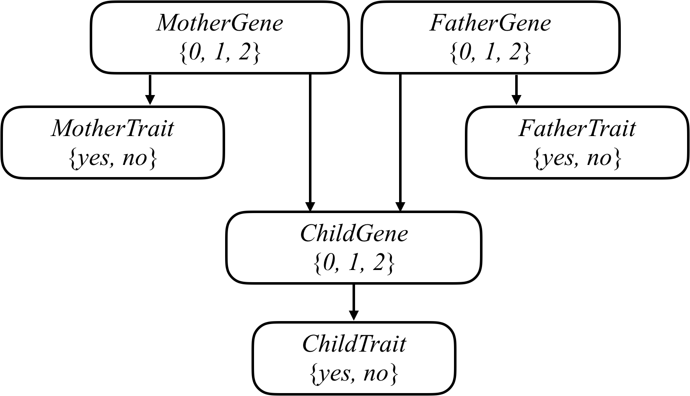

## background

突变的GJB2基因是新生儿听力减退的主要原因之一。每个人将会携带两份该类基因，因此每个人的GJB2基因有三种排列可能：0份突变基因，1份突变基因，2份突变基因

（记正常GJB2基因为A，突变GJB2基因为B，则每个人的GJB2基因情况为AA,AB,BB中的一种）

当前困境：具体每个人的AA,AB,BB情况是难以直接测量的，我们只能通过基因表现出的性状来间接推测基因组合情况，即是否有听力减退症状，同时，由于GJB2基因并不是听力减退的唯一原因，基因组合情况和性状并不是完全一一对应的（即即使没有突变基因也可能表现出听力减退症状）

每一个新生儿都会各自从父母继承一份GJB2基因，以母亲为例，AA的母亲只会传递A基因，BB的母亲只会传递B基因，AB的母亲传递A，B基因的概率各占1/2。

令问题变得更复杂的是，被传递的基因到被孩子继承的过程中，还会出现突变的概率（A->B,B->A），如果母亲传递的是A基因，则孩子有1-p概率继承A基因，p概率继承B基因（p即突变概率）

在程序中，用Gene变量表示家族中一人有多少突变基因，用Trait表示性状。

1. csv文件中表明了人名，父母情况，和性状情况。
2. py文件中的PROBS定义了，无条件的情况下，基因的可能组合对应的概率、在不同基因组合的情况下表现出特定性状的概率、基因在传递过程中的突变概率

